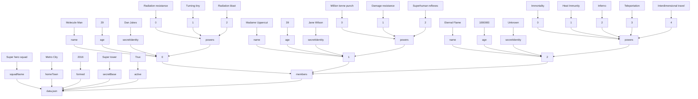

```mermaid
graph TD
4326[data.json]
6961[squadName]
6961-->4326
8029[Super hero squad]
8029-->6961
9562[homeTown]
9562-->4326
3340[Metro City]
3340-->9562
2041[formed]
2041-->4326
4526[2016]
4526-->2041
7811[secretBase]
7811-->4326
4707[Super tower]
4707-->7811
9740[active]
9740-->4326
2835[True]
2835-->9740
2587[members]
2587-->4326
2721[0]
2721-->2587
8949[name]
8949-->2721
8837[Molecule Man]
8837-->8949
2170[age]
2170-->2721
9914[29]
9914-->2170
7766[secretIdentity]
7766-->2721
5579[Dan Jukes]
5579-->7766
662[powers]
662-->2721
9782[0]
9782-->662
2965[Radiation resistance]
2965-->9782
4021[1]
4021-->662
2503[Turning tiny]
2503-->4021
1037[2]
1037-->662
2495[Radiation blast]
2495-->1037
1261[1]
1261-->2587
9617[name]
9617-->1261
2832[Madame Uppercut]
2832-->9617
5504[age]
5504-->1261
8715[39]
8715-->5504
6455[secretIdentity]
6455-->1261
4064[Jane Wilson]
4064-->6455
658[powers]
658-->1261
2251[0]
2251-->658
9132[Million tonne punch]
9132-->2251
2412[1]
2412-->658
8757[Damage resistance]
8757-->2412
2458[2]
2458-->658
3970[Superhuman reflexes]
3970-->2458
9907[2]
9907-->2587
1870[name]
1870-->9907
1961[Eternal Flame]
1961-->1870
1416[age]
1416-->9907
2713[1000000]
2713-->1416
5051[secretIdentity]
5051-->9907
326[Unknown]
326-->5051
3830[powers]
3830-->9907
7257[0]
7257-->3830
7245[Immortality]
7245-->7257
6697[1]
6697-->3830
2826[Heat Immunity]
2826-->6697
6438[2]
6438-->3830
733[Inferno]
733-->6438
7151[3]
7151-->3830
9809[Teleportation]
9809-->7151
4181[4]
4181-->3830
3911[Interdimensional travel]
3911-->4181
```