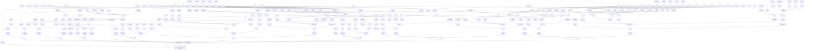

```mermaid
graph TD
6631["/workspaces/mermaid-map/test.json"]
7043["_type"]
7043-->6631
678["Module"]
678-->7043
9852["body"]
9852-->6631
5565["0"]
5565-->9852
7353["_type"]
7353-->5565
7907["Import"]
7907-->7353
4073["names"]
4073-->5565
9374["0"]
9374-->4073
171["_type"]
171-->9374
8072["alias"]
8072-->171
9657["asname"]
9657-->9374
3265["None"]
3265-->9657
7397["name"]
7397-->9374
5687["pandas"]
5687-->7397
4844["1"]
4844-->9852
154["_type"]
154-->4844
8336["Import"]
8336-->154
6878["names"]
6878-->4844
7026["0"]
7026-->6878
6125["_type"]
6125-->7026
616["alias"]
616-->6125
4972["asname"]
4972-->7026
7201["None"]
7201-->4972
1804["name"]
1804-->7026
6198["ast"]
6198-->1804
9148["2"]
9148-->9852
2374["_type"]
2374-->9148
2061["ImportFrom"]
2061-->2374
2638["level"]
2638-->9148
3002["0"]
3002-->2638
9446["module"]
9446-->9148
3968["pandas"]
3968-->9446
6098["names"]
6098-->9148
9297["0"]
9297-->6098
4344["_type"]
4344-->9297
1608["alias"]
1608-->4344
9794["asname"]
9794-->9297
4630["None"]
4630-->9794
6409["name"]
6409-->9297
9383["DataFrame"]
9383-->6409
1999["3"]
1999-->9852
6872["_type"]
6872-->1999
2566["Assign"]
2566-->6872
1221["targets"]
1221-->1999
1999["0"]
1999-->1221
1983["_type"]
1983-->1999
2161["Name"]
2161-->1983
980["value"]
980-->1999
8500["_type"]
8500-->980
4000["Constant"]
4000-->8500
2343["kind"]
2343-->980
8583["None"]
8583-->2343
3265["n"]
3265-->980
1582["test.txt"]
1582-->3265
774["s"]
774-->980
737["test.txt"]
737-->774
7145["value"]
7145-->980
6453["test.txt"]
6453-->7145
970["4"]
970-->9852
7209["_type"]
7209-->970
1805["Assign"]
1805-->7209
9847["targets"]
9847-->970
4542["0"]
4542-->9847
6667["_type"]
6667-->4542
1856["Name"]
1856-->6667
4437["value"]
4437-->970
7836["_type"]
7836-->4437
3006["Constant"]
3006-->7836
6240["kind"]
6240-->4437
8387["None"]
8387-->6240
4972["n"]
4972-->4437
9055["test2.txt"]
9055-->4972
7737["s"]
7737-->4437
5269["test2.txt"]
5269-->7737
8478["value"]
8478-->4437
4365["test2.txt"]
4365-->8478
2279["5"]
2279-->9852
623["_type"]
623-->2279
9656["With"]
9656-->623
8577["body"]
8577-->2279
9088["0"]
9088-->8577
3252["_type"]
3252-->9088
5245["Expr"]
5245-->3252
2853["value"]
2853-->9088
8824["_type"]
8824-->2853
7686["Call"]
7686-->8824
3062["args"]
3062-->2853
5418["0"]
5418-->3062
807["_type"]
807-->5418
191["Name"]
191-->807
9379["func"]
9379-->2853
7280["_type"]
7280-->9379
8385["Name"]
8385-->7280
9806["keywords"]
9806-->2853
4826["1"]
4826-->8577
9945["_type"]
9945-->4826
8414["Import"]
8414-->9945
7612["names"]
7612-->4826
6422["0"]
6422-->7612
8538["_type"]
8538-->6422
2726["alias"]
2726-->8538
3081["asname"]
3081-->6422
2847["None"]
2847-->3081
9430["name"]
9430-->6422
215["numpy"]
215-->9430
6939["items"]
6939-->2279
6512["0"]
6512-->6939
3726["_type"]
3726-->6512
8244["withitem"]
8244-->3726
6610["context_expr"]
6610-->6512
5590["_type"]
5590-->6610
5420["Call"]
5420-->5590
7203["args"]
7203-->6610
4350["0"]
4350-->7203
3708["_type"]
3708-->4350
8854["Name"]
8854-->3708
9605["1"]
9605-->7203
1789["_type"]
1789-->9605
748["Constant"]
748-->1789
8556["kind"]
8556-->9605
8615["None"]
8615-->8556
477["n"]
477-->9605
7803["r"]
7803-->477
283["s"]
283-->9605
3346["r"]
3346-->283
3272["value"]
3272-->9605
2291["r"]
2291-->3272
5693["func"]
5693-->6610
4781["_type"]
4781-->5693
4892["Name"]
4892-->4781
4874["keywords"]
4874-->6610
1833["0"]
1833-->4874
9251["_type"]
9251-->1833
5320["keyword"]
5320-->9251
9751["arg"]
9751-->1833
918["encoding"]
918-->9751
6798["value"]
6798-->1833
5771["_type"]
5771-->6798
3276["Constant"]
3276-->5771
1535["kind"]
1535-->6798
338["None"]
338-->1535
3673["n"]
3673-->6798
1412["utf-8"]
1412-->3673
2829["s"]
2829-->6798
2232["utf-8"]
2232-->2829
2652["value"]
2652-->6798
2717["utf-8"]
2717-->2652
8214["optional_vars"]
8214-->6512
3756["_type"]
3756-->8214
8979["Name"]
8979-->3756
5676["6"]
5676-->9852
3553["_type"]
3553-->5676
6143["Assign"]
6143-->3553
5296["targets"]
5296-->5676
614["0"]
614-->5296
6605["_type"]
6605-->614
776["Name"]
776-->6605
7255["value"]
7255-->5676
6882["_type"]
6882-->7255
9979["Call"]
9979-->6882
6625["args"]
6625-->7255
3083["0"]
3083-->6625
7771["_type"]
7771-->3083
5281["Name"]
5281-->7771
5014["func"]
5014-->7255
552["_type"]
552-->5014
7342["Attribute"]
7342-->552
7125["attr"]
7125-->5014
1999["read_csv"]
1999-->7125
3287["value"]
3287-->5014
7210["_type"]
7210-->3287
1203["Name"]
1203-->7210
3274["keywords"]
3274-->7255
689["7"]
689-->9852
7168["_type"]
7168-->689
5544["With"]
5544-->7168
1552["body"]
1552-->689
3046["0"]
3046-->1552
8739["_type"]
8739-->3046
6110["Expr"]
6110-->8739
8677["value"]
8677-->3046
2929["_type"]
2929-->8677
2257["Call"]
2257-->2929
1946["args"]
1946-->8677
821["0"]
821-->1946
835["_type"]
835-->821
3591["Name"]
3591-->835
5739["func"]
5739-->8677
623["_type"]
623-->5739
8252["Name"]
8252-->623
8522["keywords"]
8522-->8677
9943["items"]
9943-->689
8442["0"]
8442-->9943
2977["_type"]
2977-->8442
372["withitem"]
372-->2977
7331["context_expr"]
7331-->8442
3019["_type"]
3019-->7331
4386["Call"]
4386-->3019
3695["args"]
3695-->7331
5978["0"]
5978-->3695
8695["_type"]
8695-->5978
9498["Name"]
9498-->8695
7452["1"]
7452-->3695
3704["_type"]
3704-->7452
7494["Constant"]
7494-->3704
287["kind"]
287-->7452
6376["None"]
6376-->287
3976["n"]
3976-->7452
3752["w"]
3752-->3976
6989["s"]
6989-->7452
9926["w"]
9926-->6989
3248["value"]
3248-->7452
7591["w"]
7591-->3248
6263["func"]
6263-->7331
6640["_type"]
6640-->6263
7997["Name"]
7997-->6640
7392["keywords"]
7392-->7331
1269["0"]
1269-->7392
3142["_type"]
3142-->1269
2816["keyword"]
2816-->3142
4900["arg"]
4900-->1269
6902["encoding"]
6902-->4900
2062["value"]
2062-->1269
7087["_type"]
7087-->2062
1486["Constant"]
1486-->7087
4528["kind"]
4528-->2062
5860["None"]
5860-->4528
5054["n"]
5054-->2062
7334["utf-8"]
7334-->5054
3300["s"]
3300-->2062
2070["utf-8"]
2070-->3300
3156["value"]
3156-->2062
2438["utf-8"]
2438-->3156
8195["optional_vars"]
8195-->8442
5760["_type"]
5760-->8195
4357["Name"]
4357-->5760
8406["8"]
8406-->9852
8651["_type"]
8651-->8406
3132["With"]
3132-->8651
3865["body"]
3865-->8406
5449["0"]
5449-->3865
1482["_type"]
1482-->5449
7289["Expr"]
7289-->1482
2779["value"]
2779-->5449
486["_type"]
486-->2779
2865["Call"]
2865-->486
3944["args"]
3944-->2779
6923["0"]
6923-->3944
1731["_type"]
1731-->6923
1541["Name"]
1541-->1731
4781["func"]
4781-->2779
1318["_type"]
1318-->4781
799["Name"]
799-->1318
565["keywords"]
565-->2779
5457["items"]
5457-->8406
9478["0"]
9478-->5457
304["_type"]
304-->9478
5038["withitem"]
5038-->304
5242["context_expr"]
5242-->9478
7029["_type"]
7029-->5242
452["Call"]
452-->7029
8467["args"]
8467-->5242
3441["0"]
3441-->8467
2555["_type"]
2555-->3441
9480["Constant"]
9480-->2555
8969["kind"]
8969-->3441
6374["None"]
6374-->8969
4452["n"]
4452-->3441
3295["file_abc.txt"]
3295-->4452
1313["s"]
1313-->3441
4108["file_abc.txt"]
4108-->1313
7264["value"]
7264-->3441
2301["file_abc.txt"]
2301-->7264
4102["1"]
4102-->8467
323["_type"]
323-->4102
5914["Constant"]
5914-->323
2663["kind"]
2663-->4102
7294["None"]
7294-->2663
8551["n"]
8551-->4102
5246["w"]
5246-->8551
205["s"]
205-->4102
549["w"]
549-->205
3558["value"]
3558-->4102
678["w"]
678-->3558
4448["func"]
4448-->5242
5569["_type"]
5569-->4448
9806["Name"]
9806-->5569
2914["keywords"]
2914-->5242
2537["0"]
2537-->2914
9548["_type"]
9548-->2537
17["keyword"]
17-->9548
1892["arg"]
1892-->2537
4318["encoding"]
4318-->1892
6881["value"]
6881-->2537
6732["_type"]
6732-->6881
5301["Constant"]
5301-->6732
4391["kind"]
4391-->6881
4318["None"]
4318-->4391
3413["n"]
3413-->6881
7984["utf-8"]
7984-->3413
965["s"]
965-->6881
6709["utf-8"]
6709-->965
1377["value"]
1377-->6881
6012["utf-8"]
6012-->1377
3195["optional_vars"]
3195-->9478
1506["_type"]
1506-->3195
6278["Name"]
6278-->1506
4129["type_ignores"]
4129-->6631

```
