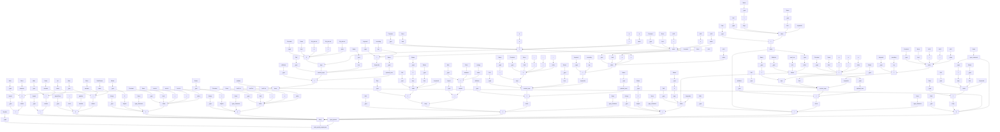

```mermaid
graph TD
2112["hello_world_output.json"]
7105["_type"]
7105-->2112
8611["Module"]
8611-->7105
1425["body"]
1425-->2112
2693["0"]
2693-->1425
9376["_type"]
9376-->2693
6399["Import"]
6399-->9376
2191["names"]
2191-->2693
6775["0"]
6775-->2191
7216["_type"]
7216-->6775
5145["alias"]
5145-->7216
9401["asname"]
9401-->6775
9581["None"]
9581-->9401
4283["name"]
4283-->6775
7056["pandas"]
7056-->4283
1283["1"]
1283-->1425
8031["_type"]
8031-->1283
1715["Import"]
1715-->8031
2409["names"]
2409-->1283
6090["0"]
6090-->2409
5515["_type"]
5515-->6090
7996["alias"]
7996-->5515
423["asname"]
423-->6090
2292["None"]
2292-->423
8385["name"]
8385-->6090
8346["ast"]
8346-->8385
744["2"]
744-->1425
2581["_type"]
2581-->744
8039["ImportFrom"]
8039-->2581
572["level"]
572-->744
2893["0"]
2893-->572
752["module"]
752-->744
8028["pandas"]
8028-->752
9072["names"]
9072-->744
9501["0"]
9501-->9072
8125["_type"]
8125-->9501
9874["alias"]
9874-->8125
3623["asname"]
3623-->9501
6145["None"]
6145-->3623
1951["name"]
1951-->9501
5255["DataFrame"]
5255-->1951
5966["3"]
5966-->1425
7307["_type"]
7307-->5966
7425["Assign"]
7425-->7307
335["targets"]
335-->5966
1421["0"]
1421-->335
3174["_type"]
3174-->1421
1550["Name"]
1550-->3174
8702["type_comment"]
8702-->5966
3519["None"]
3519-->8702
329["value"]
329-->5966
3584["_type"]
3584-->329
652["Constant"]
652-->3584
5221["kind"]
5221-->329
7612["None"]
7612-->5221
8810["n"]
8810-->329
2212["test.txt"]
2212-->8810
5126["s"]
5126-->329
7756["test.txt"]
7756-->5126
3143["value"]
3143-->329
7090["test.txt"]
7090-->3143
7527["4"]
7527-->1425
2055["_type"]
2055-->7527
1748["Assign"]
1748-->2055
4915["targets"]
4915-->7527
8669["0"]
8669-->4915
3641["_type"]
3641-->8669
5480["Name"]
5480-->3641
8784["type_comment"]
8784-->7527
6541["None"]
6541-->8784
9212["value"]
9212-->7527
2703["_type"]
2703-->9212
1285["Constant"]
1285-->2703
5179["kind"]
5179-->9212
1664["None"]
1664-->5179
7227["n"]
7227-->9212
3956["test2.txt"]
3956-->7227
8218["s"]
8218-->9212
7450["test2.txt"]
7450-->8218
927["value"]
927-->9212
809["test2.txt"]
809-->927
8697["5"]
8697-->1425
9815["_type"]
9815-->8697
1437["With"]
1437-->9815
7751["body"]
7751-->8697
5956["0"]
5956-->7751
5575["_type"]
5575-->5956
1980["Expr"]
1980-->5575
2200["value"]
2200-->5956
8422["_type"]
8422-->2200
4931["Call"]
4931-->8422
215["args"]
215-->2200
4162["0"]
4162-->215
5651["_type"]
5651-->4162
7018["Name"]
7018-->5651
344["func"]
344-->2200
8567["_type"]
8567-->344
6347["Name"]
6347-->8567
7113["keywords"]
7113-->2200
2475["1"]
2475-->7751
3241["_type"]
3241-->2475
3832["Import"]
3832-->3241
3843["names"]
3843-->2475
6810["0"]
6810-->3843
5254["_type"]
5254-->6810
3729["alias"]
3729-->5254
644["asname"]
644-->6810
2634["None"]
2634-->644
4926["name"]
4926-->6810
2774["numpy"]
2774-->4926
7208["items"]
7208-->8697
5098["0"]
5098-->7208
6966["_type"]
6966-->5098
6886["withitem"]
6886-->6966
4719["context_expr"]
4719-->5098
8169["_type"]
8169-->4719
1075["Call"]
1075-->8169
5424["args"]
5424-->4719
8350["0"]
8350-->5424
2763["_type"]
2763-->8350
9573["Name"]
9573-->2763
8441["1"]
8441-->5424
7493["_type"]
7493-->8441
3732["Constant"]
3732-->7493
7523["kind"]
7523-->8441
1786["None"]
1786-->7523
1364["n"]
1364-->8441
4098["r"]
4098-->1364
3644["s"]
3644-->8441
4977["r"]
4977-->3644
920["value"]
920-->8441
480["r"]
480-->920
6660["func"]
6660-->4719
5284["_type"]
5284-->6660
161["Name"]
161-->5284
3461["keywords"]
3461-->4719
3682["0"]
3682-->3461
5442["_type"]
5442-->3682
5233["keyword"]
5233-->5442
2664["arg"]
2664-->3682
1693["encoding"]
1693-->2664
3236["value"]
3236-->3682
6924["_type"]
6924-->3236
7080["Constant"]
7080-->6924
9271["kind"]
9271-->3236
6103["None"]
6103-->9271
5474["n"]
5474-->3236
6107["utf-8"]
6107-->5474
6782["s"]
6782-->3236
1559["utf-8"]
1559-->6782
7982["value"]
7982-->3236
3511["utf-8"]
3511-->7982
3041["optional_vars"]
3041-->5098
9569["_type"]
9569-->3041
2375["Name"]
2375-->9569
5612["type_comment"]
5612-->8697
338["None"]
338-->5612
1681["6"]
1681-->1425
9421["_type"]
9421-->1681
1276["Assign"]
1276-->9421
8393["targets"]
8393-->1681
2685["0"]
2685-->8393
3106["_type"]
3106-->2685
9719["Name"]
9719-->3106
2698["type_comment"]
2698-->1681
3332["None"]
3332-->2698
6626["value"]
6626-->1681
2026["_type"]
2026-->6626
4537["Call"]
4537-->2026
7507["args"]
7507-->6626
9292["0"]
9292-->7507
3523["_type"]
3523-->9292
7848["Name"]
7848-->3523
3180["func"]
3180-->6626
7312["_type"]
7312-->3180
1804["Attribute"]
1804-->7312
2919["attr"]
2919-->3180
1871["read_csv"]
1871-->2919
7106["value"]
7106-->3180
1078["_type"]
1078-->7106
6062["Name"]
6062-->1078
1308["keywords"]
1308-->6626
1742["7"]
1742-->1425
8119["_type"]
8119-->1742
4922["With"]
4922-->8119
6062["body"]
6062-->1742
5800["0"]
5800-->6062
4565["_type"]
4565-->5800
9452["Expr"]
9452-->4565
5110["value"]
5110-->5800
2844["_type"]
2844-->5110
5153["Call"]
5153-->2844
7459["args"]
7459-->5110
3319["0"]
3319-->7459
8521["_type"]
8521-->3319
9820["Name"]
9820-->8521
2257["func"]
2257-->5110
1636["_type"]
1636-->2257
1723["Name"]
1723-->1636
4822["keywords"]
4822-->5110
9968["items"]
9968-->1742
5916["0"]
5916-->9968
5832["_type"]
5832-->5916
5099["withitem"]
5099-->5832
1613["context_expr"]
1613-->5916
2671["_type"]
2671-->1613
6602["Call"]
6602-->2671
3448["args"]
3448-->1613
8915["0"]
8915-->3448
6735["_type"]
6735-->8915
928["Name"]
928-->6735
2977["1"]
2977-->3448
3195["_type"]
3195-->2977
1490["Constant"]
1490-->3195
72["kind"]
72-->2977
1253["None"]
1253-->72
3371["n"]
3371-->2977
2267["w"]
2267-->3371
5109["s"]
5109-->2977
9824["w"]
9824-->5109
6825["value"]
6825-->2977
6025["w"]
6025-->6825
5365["func"]
5365-->1613
3849["_type"]
3849-->5365
8975["Name"]
8975-->3849
6597["keywords"]
6597-->1613
7159["0"]
7159-->6597
5183["_type"]
5183-->7159
4160["keyword"]
4160-->5183
7958["arg"]
7958-->7159
7860["encoding"]
7860-->7958
507["value"]
507-->7159
6507["_type"]
6507-->507
1030["Constant"]
1030-->6507
5014["kind"]
5014-->507
4674["None"]
4674-->5014
4225["n"]
4225-->507
4112["utf-8"]
4112-->4225
4038["s"]
4038-->507
4155["utf-8"]
4155-->4038
3799["value"]
3799-->507
1066["utf-8"]
1066-->3799
5200["optional_vars"]
5200-->5916
8867["_type"]
8867-->5200
3180["Name"]
3180-->8867
2252["type_comment"]
2252-->1742
9558["None"]
9558-->2252
3420["8"]
3420-->1425
1005["_type"]
1005-->3420
7666["With"]
7666-->1005
4606["body"]
4606-->3420
8520["0"]
8520-->4606
255["_type"]
255-->8520
8378["Expr"]
8378-->255
1849["value"]
1849-->8520
8436["_type"]
8436-->1849
5529["Call"]
5529-->8436
7197["args"]
7197-->1849
1530["0"]
1530-->7197
3556["_type"]
3556-->1530
2537["Name"]
2537-->3556
9370["func"]
9370-->1849
8767["_type"]
8767-->9370
9762["Name"]
9762-->8767
7841["keywords"]
7841-->1849
4283["items"]
4283-->3420
574["0"]
574-->4283
3382["_type"]
3382-->574
6242["withitem"]
6242-->3382
6906["context_expr"]
6906-->574
588["_type"]
588-->6906
86["Call"]
86-->588
58["args"]
58-->6906
712["0"]
712-->58
5158["_type"]
5158-->712
1282["Constant"]
1282-->5158
126["kind"]
126-->712
714["None"]
714-->126
2041["n"]
2041-->712
3708["file_abc.txt"]
3708-->2041
8484["s"]
8484-->712
5994["file_abc.txt"]
5994-->8484
8008["value"]
8008-->712
7718["file_abc.txt"]
7718-->8008
1559["1"]
1559-->58
9793["_type"]
9793-->1559
6139["Constant"]
6139-->9793
1150["kind"]
1150-->1559
4030["None"]
4030-->1150
8984["n"]
8984-->1559
7984["w"]
7984-->8984
1313["s"]
1313-->1559
3677["w"]
3677-->1313
4421["value"]
4421-->1559
2427["w"]
2427-->4421
4642["func"]
4642-->6906
9242["_type"]
9242-->4642
6186["Name"]
6186-->9242
8764["keywords"]
8764-->6906
9063["0"]
9063-->8764
6694["_type"]
6694-->9063
4441["keyword"]
4441-->6694
7847["arg"]
7847-->9063
8274["encoding"]
8274-->7847
8777["value"]
8777-->9063
8012["_type"]
8012-->8777
671["Constant"]
671-->8012
8689["kind"]
8689-->8777
2899["None"]
2899-->8689
4375["n"]
4375-->8777
8242["utf-8"]
8242-->4375
5620["s"]
5620-->8777
9546["utf-8"]
9546-->5620
4663["value"]
4663-->8777
3494["utf-8"]
3494-->4663
9665["optional_vars"]
9665-->574
5541["_type"]
5541-->9665
8127["Name"]
8127-->5541
2537["type_comment"]
2537-->3420
836["None"]
836-->2537
1966["type_ignores"]
1966-->2112

```
