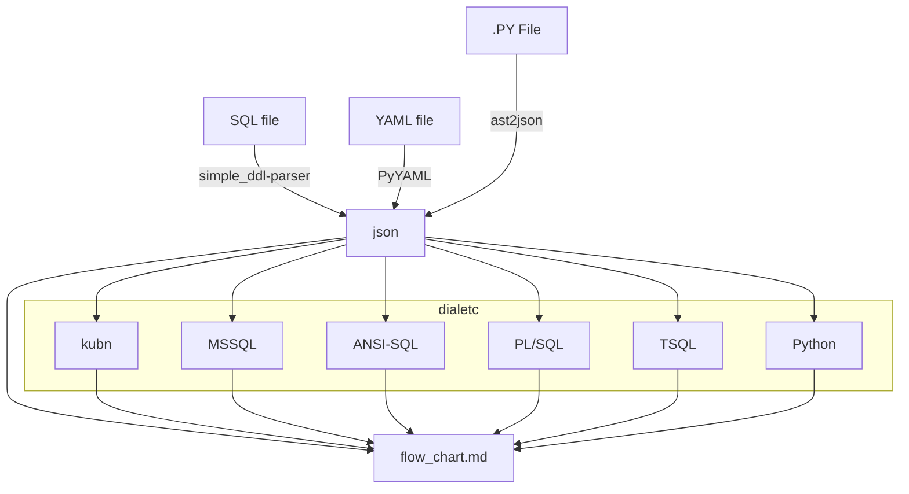

```mermaid
graph TD
    subgraph dialetc
     kubn
     MSSQL
     TSQL
     Python
     PL/SQL
     ANSI-SQL
    end
     

json-->flow_chart.md
A["SQL file"]-->|simple_ddl-parser|json
B["YAML file"]-->|PyYAML|json
C[".PY File"]--->|ast2json|json
    json-->kubn-->flow_chart.md
    json-->MSSQL-->flow_chart.md    
    json-->ANSI-SQL-->flow_chart.md
    json-->PL/SQL-->flow_chart.md
    json-->TSQL-->flow_chart.md
    json-->Python-->flow_chart.md

 

```
